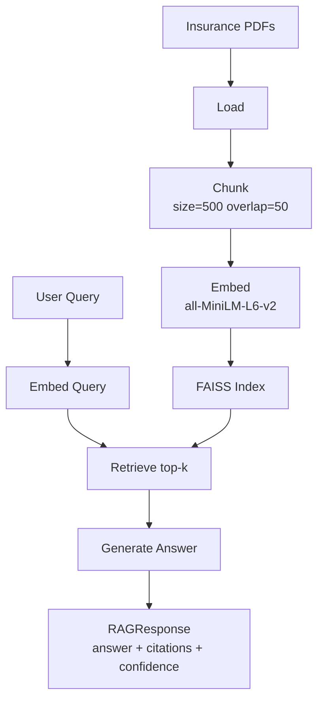

# RAG Three Ways

> The same insurance RAG pipeline built three ways — from scratch, 
> in LangChain — with a comparison of what each framework hides.

## Why Three Ways?

Anyone can follow a LangChain tutorial. The question interviewers 
actually ask is: *"Do you know what it's doing under the hood?"*

I built it without frameworks first. Then with frameworks. Now I can 
answer that question with specifics, not hand-waving.

## Architecture

## The Three-Way Comparison

| | From Scratch | LangChain |
|---|---|---|
| **Approx lines of code** | ~150 | ~30 |
| **Chunker** | Character-based, manual | RecursiveCharacterTextSplitter |
| **What chunker adds** | Nothing | Tries paragraph/line breaks first |
| **Retriever** | FAISS + manual search | FAISS + `.as_retriever()` |
| **Prompt** | Hand-written f-string | ChatPromptTemplate |
| **Output** | Plain string | Pydantic RAGResponse |
| **Hallucinated water damage numbers?** | Yes | No |
| **Total latency** | Not measured | 0.62s |
| **Retrieval latency** | Not measured | 0.02s |
| **Generation latency** | Not measured | 0.58s |
| **Best for** | Understanding internals | Production pipelines |

## Key Findings

**1. Stricter prompt = less hallucination**
From-scratch version hallucinated specific policy numbers 
(`5%, $50,000, $150,000`) that don't exist in the corpus. 
LangChain's `ChatPromptTemplate` with "answer based only on 
context" eliminated this. Same model, same corpus — the prompt 
was the difference.

**2. Generation dominates latency**
Retrieval: 0.02s · Generation: 0.58s · Total: 0.62s
Optimizing chunking or k wouldn't move p95. The lever is 
model speed or prompt caching.

**3. k matters for multi-document answers**
k=3 missed answers spanning multiple source documents. 
k=6 retrieved correctly. Formal eval pending in 
[rag-eval-harness](#) to quantify the recall delta.

**4. What LangChain actually hides**
- Document loading + metadata handling
- Recursive text splitting (smarter than character-only)
- Retriever interface abstraction
- Prompt templating with input validation
- Output parsing pipeline

## Repos in This Series

| Repo | What it proves |
|---|---|
| [`rag-from-scratch`](https://github.com/Victorianukiry/rag-from-scratch) | I know what frameworks hide |
| `rag-three-ways` (this repo) | I can compare and choose |
| `rag-eval-harness` (coming soon) | I measure everything |

## Stack

- **Embeddings:** `sentence-transformers` — `all-MiniLM-L6-v2` (384-dim)
- **Vector store:** FAISS
- **LLM:** Groq — `llama-3.3-70b-versatile`
- **Framework:** LangChain (LCEL)
- **Structured outputs:** Pydantic
