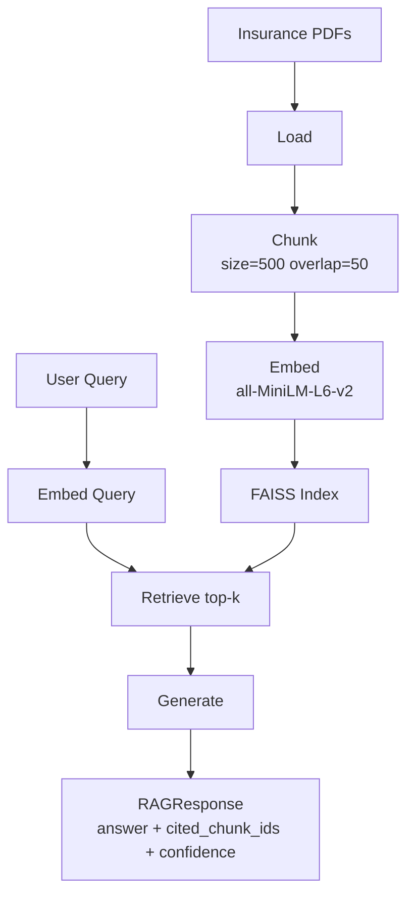

# RAG: From Scratch vs. LangChain

> The same retrieval pipeline over the same corpus, built two ways — once with no
> framework, once in LangChain — with an honest account of what the framework adds,
> what it hides, and what this comparison does and doesn't establish.

Corpus: four commercial insurance and risk-management PDFs (Alberta higher-education
sector), 146 pages.

## Why Build It Twice?

Anyone can follow a LangChain tutorial. The question interviewers actually ask is
*"do you know what it's doing underneath?"*

I built it without frameworks first. Then with frameworks. Now I can answer that
question with specifics.

## Architecture

```mermaid
flowchart TD
    A[Insurance PDFs] --> B[Load]
    B --> C[Chunk\nsize=500 overlap=50]
    C --> D[Embed\nall-MiniLM-L6-v2]
    D --> E[FAISS Index]
    F[User Query] --> G[Embed Query]
    G --> H[Retrieve top-k]
    E --> H
    H --> I[Generate]
    I --> J[RAGResponse\nanswer + cited_chunk_ids + confidence]
```

## Side by Side

| | From scratch | LangChain |
|---|---|---|
| **Approx. pipeline LOC** | ~150 | ~30 |
| **Loader** | custom `Document` dataclass + `pypdf` | `PyPDFDirectoryLoader` |
| **Chunker** | character-based, 500/50 | `RecursiveCharacterTextSplitter`, 500/50 |
| **What the chunker adds** | nothing — hard character cuts | tries paragraph and line breaks before cutting |
| **Units indexed** | 166 chunks (whole documents) | 237 chunks (146 pages) |
| **Vector store** | FAISS `IndexFlatL2` + manual search | FAISS via `.as_retriever()` |
| **k used in the run** | 6 | 12 |
| **Prompt** | hand-written f-string | `ChatPromptTemplate` |
| **Output** | plain string | Pydantic `RAGResponse` |
| **Citations** | source filename in prompt context | `cited_chunk_ids` field, validated |
| **Generation** | Groq `llama-3.3-70b-versatile` | Groq `llama-3.3-70b-versatile` |
| **Observability** | none | LangSmith tracing + timing |

## ⚠️ What This Comparison Does Not Establish

**This is not a controlled experiment, and I'm not going to pretend it is.**

Between the two builds, four things changed at once: the chunker (character vs.
recursive), the resulting chunk count (166 vs. 237), the retrieval depth (k=6 vs. k=12),
and the prompt. The generation model is the same in both (`llama-3.3-70b-versatile`),
so that variable at least is held constant — but the rest are confounded.

That means any difference in output quality **cannot** be attributed to any single one of
them. Isolating the prompt would require holding k, the chunker, and the chunk count
fixed and changing only the prompt text. That run is the next thing on the list.

I'm leaving this section in because a confounded comparison presented as a clean one is
worse than no comparison.

## What I Actually Observed

**1. Both pipelines answer correctly, with attribution**

For *"what is covered for water damage?"*, both return the same figures — a 5% minimum
$50,000 deductible subject to a $150,000 maximum — and both attribute them to the
Edmonton symposium document. The figures are present in the corpus; both retrievers
found them. Outputs are preserved in the notebooks.

**2. Generation dominates latency**

Retrieval 0.02s · generation 0.58s · total 0.62s.

*Caveat: this is a single measurement, not a distribution.* Directionally it says the
optimization lever is model speed or prompt caching rather than chunking or k — but a
proper p50/p95 over repeated runs is needed before anyone should act on that. Not yet done.

**3. Retrieval depth changes multi-document answers**

At k=3 the from-scratch retriever missed answers spanning more than one source document;
k=6 retrieved them. This is a recall problem, and eyeballing it isn't good enough — which
is exactly why the next repo exists. Quantifying the recall delta is pending in
[`rag-eval-harness`](https://github.com/Victorianukiry/rag-eval-harness).

**4. Structured output is where LangChain earns its keep**

Binding a Pydantic `RAGResponse` — `answer`, `cited_chunk_ids`, `confidence` — via
`.with_structured_output()` turns a free-text blob into something a downstream system can
branch on. Getting citations to resolve required rewriting `format_docs` to inject
`[chunk_i]` markers with source and page into the context; without that the model has
nothing stable to cite.

**5. What LangChain actually hides**

- Document loading and metadata propagation
- Recursive text splitting (structure-aware rather than character-only)
- The retriever interface abstraction
- Prompt templating with input validation
- Output parsing and schema coercion

## Stack

- **Embeddings:** `sentence-transformers` — `all-MiniLM-L6-v2` (384-dim)
- **Vector store:** FAISS
- **LLM:** Groq — `llama-3.3-70b-versatile`
- **Framework:** LangChain (LCEL)
- **Structured outputs:** Pydantic
- **Tracing:** LangSmith

## Related

| Repo | What it covers |
|---|---|
| [`rag-from-scratch`](https://github.com/Victorianukiry/rag-from-scratch) | The no-framework build |
| `rag-three-ways` (this repo) | The LangChain build and the comparison |
| [`rag-eval-harness`](https://github.com/Victorianukiry/rag-eval-harness) | Retrieval metrics from first principles |

*Repo name is historical — a LlamaIndex build was planned as the third way and hasn't
been built.*
